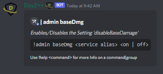

# Base Damage

This command allows `Killfeed Admin` to toggle the `'disableBaseDamage'` configuration setting on the gameserver.

> #### Command invoke: ```!admin baseDamage```

!!! note
> + Enabling/disabling the Base Damage settings will only reflect any changes made after the next restart of the gameserver.
> + `On` allows any player-built structures (i.e. fences, watchtowers, platforms, territory flags) to receive damage and be destroyed by players and explosives.
> + `Off` prevents these structures from being destroyed by damage, but doesn't prevent players from "dismantling" them from inside the fence or tower structures.
> > + Refer to [Dismantle Feed](/config/feed_channels) to learn more about using the Feeds to track when structures are dismantled on your server.

!!! usage
```
!admin baseDamage <Service Alias> <on | off>
```


``` {.sql title="Command Aliases"}
!admin baseDmg
!admin bDmg
!admin bDamage
```

!!! example

``` {.sql title="Base Damage Command Examples" linenums="1"}
!admin baseDmg server1 on
!admin baseDamage server1 on
!admin bDmg server2 off
!admin bDamage server2 off
```

