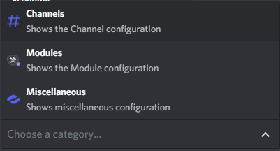
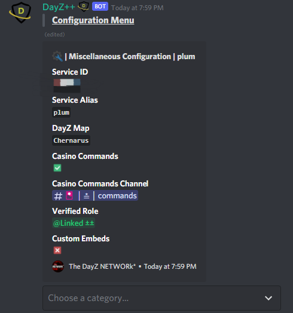
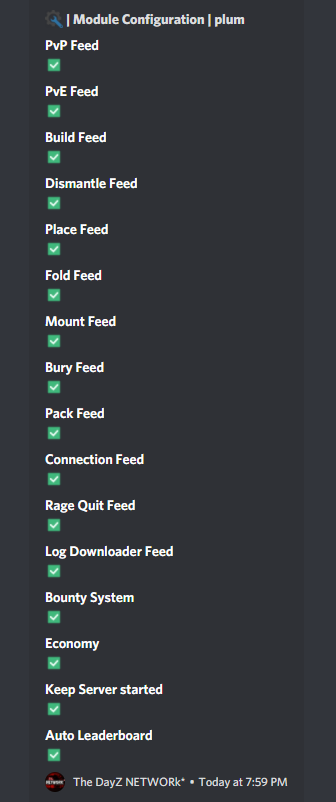
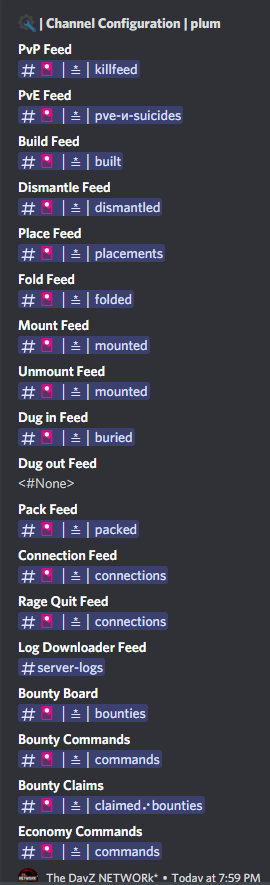

# Access Configuration Details

## Configuration Menus

This command allows `Killfeed Admin` to view the bot configuration settings per gameserver service including which modules are enabled/disabled, which channels are set for each feed, and much more informative details such as which role is assigned for verified accounts, which map is being used, service alias and ID, whether the [Casino](../economy/casino.md) commands are enabled and which channel to use them in if defined, and whether you have [Custom Embeds](../custom/custom_embeds.md) enabled or not.

> #### Command invoke: ```!admin config```

!!! note
> + The bot will respond with a droplist and Configuration Menu when executing this command.
> > 
> + Select one of the options listed `Channels`, `Modules`, or `Misc.` to view each section's configuration details.
> > Interacting with the bot menu display is easy to navigate to switch between sections back and forth.

!!! usage
```
!admin config <Service Alias>
```

!!! example

``` {.sql title="Admin Config Command Examples" linenums="1"}
!admin config server1
```


> 
> 
> 
> 
> 
