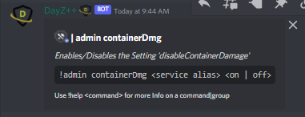

# Container Damage

This command allows `Killfeed Admin` to toggle the `'disableContainerDamage'` configuration setting on the gameserver.

> #### Command invoke: ```!admin containerDamage```

!!! note
> + Enabling/disabling the Container Damage settings will only reflect any changes made after the next restart of the gameserver.
> + `On` allows any storage container objects (i.e. tents, barrels, seachests, crates, etc.) to receive damage and be destroyed by players and explosives.
> + `Off` prevents these objects from being impacted by damage, players will still be allowed to pack and move objects if they are emptied.


!!! usage
```
!admin containerDamage <Service Alias> <on | off>
```


``` {.sql title="Command Aliases"}
!admin containerDmg
!admin cDmg
!admin cDamage
```

!!! example

``` {.sql title="Container Damage Command Examples" linenums="1"}
!admin containerDmg server1 on
!admin containerDamage server1 on
!admin cDmg server2 off
!admin cDamage server2 off
```

