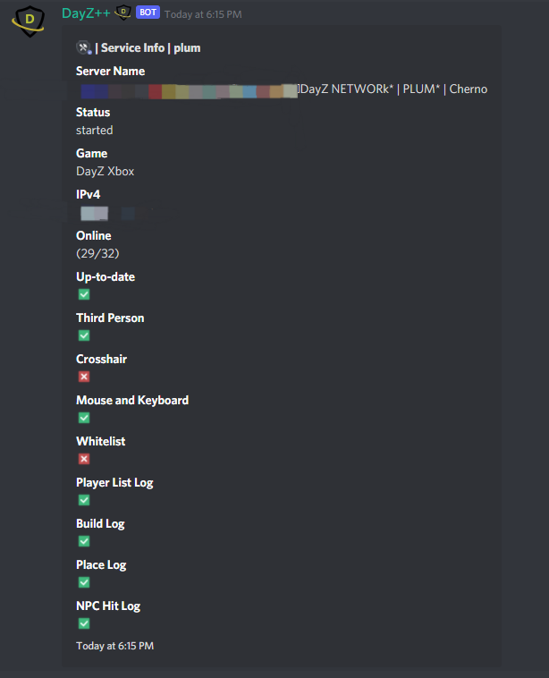

# Service Details & Info

This command allows `Killfeed Admin` to display a wide array of useful information relating to a connected service.
Information such as the status of the server i.e. `Started`, `Stopped`, or `Restarting`; players online within the server and slot size, a list showing which settings are enabled/disabled from the configuration.
> #### Command invoke: ```!admin info```

!!! note
> + ⚠️ This command responds with an embedded post containing sensitive service information for your gameserver. 
> > + Please take this into consideration when invoking the command within a channel other members have access to, as it contains your server's IP address

!!! usage
```
!admin info <Service Alias>
```

!!! example

``` {.sql title="Admin Info Command Example" linenums="1"}
!admin info server1
```

