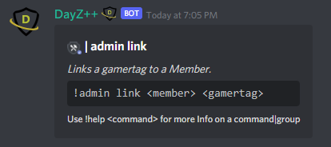

# Linking Accounts as Admin

These commands allow `Killfeed Admin` to connect/disconnect a Discord member within their server to a Gamertag. For simplicity, and convenience, we will cover both the `!admin link` and `!admin unlink` commands within this page.

> #### Command invoke: ```!admin link``` and ```!admin unlink```

!!! note
> +  Players are able to link their own account to their Discord account as well, but as an alternative, this may be helpful for linking and unlinking a member's accounts for them if they are having difficulty understanding how to use the commands or in the event a player neglects to link it themselves, or even in the rare occasion where someone happens to link an account that is not theirs.
> + Make sure for Gamertags that have spaces within them to include the spaces accordingly when executing the command. Reference example below.
> + ⚠️ The Gamertag must have played on the server since the bot was added or it may result in an error informing you that the Gamertag does not exist within the database.

!!! usage
```
!admin link <@Member> <Gamertag>
!admin unlink <@Member> <Gamertag>
```

!!! example

``` {.sql title="Admin Link and Unlink Command Example" linenums="1"}

!admin link @nxck69 Gamertag With Spaces
!admin unlink @nxck69 GamertagWithoutSpaces
```

