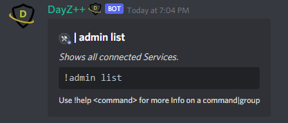

# List Connected Services

These commands allow `Killfeed Admin` to easily reference which gameserver services you have configured to the bot.

> #### Command invoke: ```!admin list```

!!! note
> +  If you have multiple gameservers added the output will list them in an embedded post along with their service ID and server alias for each.

!!! usage
```
!admin list
```

!!! example

``` {.sql title="Admin List Command Example" linenums="1"}

!admin list
```

