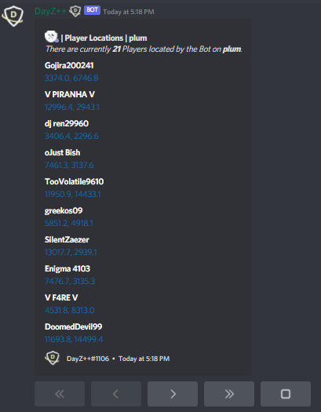

# Admin Ping

This command allows `Killfeed Admin` to ping the online list of players for a service to reveal their coordinates in-game.

> #### Command invoke: ```!admin ping```

!!! note
> + In order for this command to work properly, you must enable the `log Playerlist` setting under `General Settings` within your gameserver's Nitrado Webinterface.


!!! usage
```
!admin ping <Service Alias>
```

!!! example

``` {.sql title="Admin Ping Command Example" linenums="1"}
!admin ping server1
```

