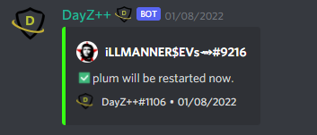

# Restart a Gameserver

This command allows `Killfeed Admin` to easily start a gameserver from it's `Stopped` state.
> #### Command invoke: ```!admin restart```

!!! note
> + ⚠️ You may need to utilize the `!admin stop` command along side of this command in the event your server manages to find itself in a "loop" or "hung" state of restarting. 
> + ♾️ On rare occasions you may experience issues with getting your server to start from a loop -- i.e. constantly starting, stopping, and restarting on it's own -- you may need to validate your server files for syntax errors or manually delete the `restart` command file which gets sent to the FTP server. *Sometimes, when this happens it may be an issue on Nitrado's end, not the bot's. It is only mentioned here as it has been useful information for us in our experience managing the gameservers.


!!! usage
```
!admin restart <Service Alias>
```

!!! example

```{.sql title="Admin Restart Command Example" linenums="1"}
!admin restart server1
```

