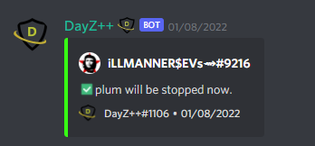

# Stop a Gameserver

This command allows `Killfeed Admin` to easily stop a gameserver from it's `Started` state.

> #### Command invoke: ```!admin stop```

!!! note
> + 🛑 Brings the gameserver to a `Stopped` state quicker than using the Webinterface or Nitrado Mobile App. 📨
> + Helps if your server is ever stuck in a looped state of restarting itself, execute this command to stop it, then follow the instructions for [restarting your gameserver.](admin_restart.md)


!!! usage
```
!admin stop <Service Alias>
```

!!! example

```{.sql title="Admin Stop Command Example" linenums="1"}
!admin stop server1
```

