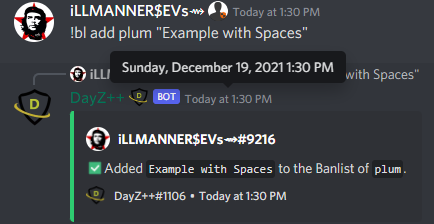

# Banlist

 Adding player accounts to the gameserver banlist.txt is an easy task that can be handled directly through command in your Discord server without the need to access the Nitrado.net webinterface.
 > + Adding/removing player accounts to the banlist.txt file via command the server will automatically register the account(s) within the next few minutes without needing to restart the gameserver itself.

!!! note 

> + When adding GTs and IGNs that include spaces in their account name, you must enclose the account name in double quotes in order for the command to write to the list appropriately. Reference line #3 in the examples below.
> + You can easily confirm the account was added successfully by using the `!banlist show <server alias>` command.

!!! usage

> + alias: `!bl`

```
!(banlist | bl) <show | remove | add> <Service Alias> [Gamertag]
```


!!! example

``` {.py3 title="Banlist Command Examples (show | remove | add) " linenums="1"}
!banlist show Server1
!bl remove Server1 GamertagWithoutSpaces
!bl add Server1 "Gamertag With Spaces"
```

