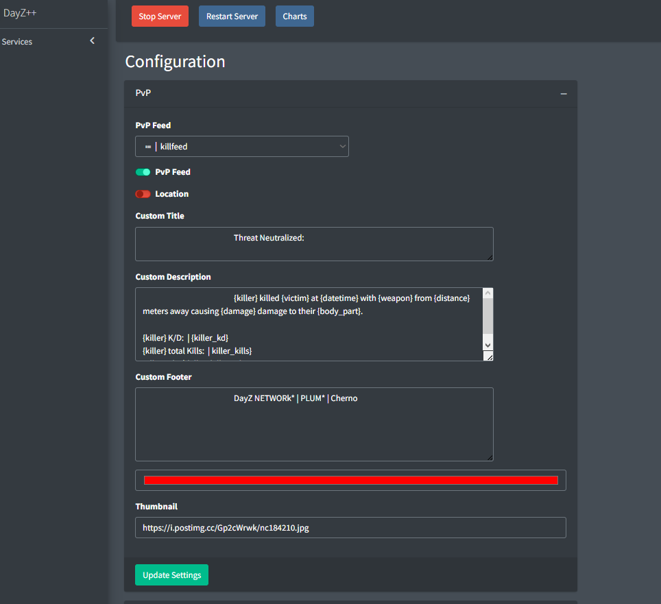

# Using Custom Embeds
> #### Configuration is Exclusive to Dashboard Only
    
DayZ++ allows it's `Killfeed Admin` with Dashboard access to utilize embedded posts on any feed modue's output  that can be customized and tailored to preference.
While there is limitations to what is allowed, you can obtain quite a personalized result depending on how you decide to configure it's options we have provided.

**Disclaimer & Fair Advisory:**
> +  We will not be able to provide continual support to anyone regarding building their customized outputs and utilizing the variables proerly.
> + If you proceed to customize your embeds, be aware, you are on your own.
> + __Worst case scenario__: *Disable the Custom Embed module, and Read the Docs.*
!!! note
#### Variables & Their Use:

> + Each feed module may be designed seperately, allowing you to change the color, description, title, footer, thumbnail, and image.
> + Each module has it's own specific sets of available variables to select from. Be mindful not to exceed the maximum allowed amount per field.

=== "Maximum Character & Variable Limits"

    ``` sql
    "TITLE"         |  150 CHAR | Each VAR 1 time
    "DESCRIPTION"   | 1500 CHAR | Each VAR 3 times
    "FOOTER"        | 1500 CHAR | Each VAR 1 time
    ```

!!! usage

``` {.sql title="Connection Feeds | Connect Variables"}
{player} | Gamertag
{time} | 14:05:12
{datetime} | Tue Dec 7 14:05:12
{last_connects} | Time of last Connections: '14:05:12'
{x} | X-Coordinate of last known Player location, '/' if unknown
{z} | Z-Coordinate of last known Player location, '/' if unknown
```

``` {.sql title="Connection Feeds | Disconnect Variables" linenums="1"}
{player} | Gamertag
{time} | 14:05:12
{datetime} | Tue Dec 7 14:05:12
{session_playtime} | Session Playtime
{total_playtime} | Total Playtime
{x} | X-Coordinate of last known Player location, '/' if unknown
{z} | Z-Coordinate of last known Player location, '/' if unknown
```

``` {.sql title="PvE Feed | Vehicle Death | Definitions" linenums="1"}
{player} | Gamertag 
{time} | 14:05:12
{datetime} | Tue Dec 7 14:05:12
{x} | X-Coord
{z} | Z-Coord
{y} | Y-Coord
{iz_url} | IZurvive Link
{vehicle} | Vehicle, Player got driven over by
```
``` {.sql title="PvE Feed | Bled out | Definitions" linenums="1"}
{player} | Gamertag 
{time} | 14:05:12
{datetime} | Tue Dec 7 14:05:12
{x} | X-Coord
{z} | Z-Coord
{y} | Y-Coord
{iz_url} | IZurvive Link
{cuts} | Amount of Cuts
```

``` {.sql title="PvE Feed | Explosion Deaths Variables | Defintions" linenums="1"}
{player} | Gamertag 
{time} | 14:05:12
{datetime} | Tue Dec 7 14:05:12
{x} | X-Coord
{z} | Z-Coord
{y} | Y-Coord
{iz_url} | IZurvive Link
{explosion} | Explosion
```

``` {.sql title="PvE Feed | Suicide | Fall | Zombie | Wolf | Bear | Respawn Feed Variables & Definitions" linenums="1"}
{player} | Gamertag 
{time} | 14:05:12
{datetime} | Tue Dec 7 14:05:12
{x} | X-Coord
{z} | Z-Coord
{y} | Y-Coord
{iz_url} | IZurvive Link
```

``` {.sql title="Rage Quit Variables | Definitions" linenums="1"}
{player} | Gamertag
{time} | 14:05:12
{datetime} | Tue Dec 7 14:05:12
{hit_by} | Player the last damage was taken from
{x} | Last known X Coord
{z} | Last known Z Coord
```

``` {.sql title="Combat Log Variables | Defintions" linenums="1"}
{player} | Gamertag 
{time} | 14:05:12
{datetime} | Tue Dec 7 14:05:12
{x} | X-Coord
{z} | Z-Coord
{y} | Y-Coord
{iz_url} | IZurvive Link
{item}
```

``` {.sql title="Pack | Fold | Place | Mount | Unmount | Dug in | Dug out  Feed Variables & Definitions" linenums="1"}
{player} | Gamertag 
{time} | 14:05:12
{datetime} | Tue Dec 7 14:05:12
{x} | X-Coord
{z} | Z-Coord
{y} | Y-Coord
{iz_url} | IZurvive Link
{tool} | Tool
{part} | Part
```

``` {.sql title="KillFeed Variables | Variable Definition" linenums="1"}
{killer} | Killer Gamertag
{victim} | Victim Gamertag
{time} | 14:05:12
{datetime} | Tue Dec 7 14:05:12
{x} | X-Coord
{z} | Z-Coord
{y} | Y-Coord
{iz_url} | IZurvive Link
{time_alive} | Time Alive
{weapon} | Weapon
{distance} | Distance as Number
{damage} | Damage Value as Number
{body_part} | Body Part like Torso
{killer_kd} | Killer's PvP K/D
{killer_kills} | Killer's total kills
{killer_killstreak} | Killer's current killstreak
{victim_kd} | Victim's PvP K/D
{victim_deaths} | Victim's total PvP Deaths
{victim_deathstreak} | Victim's current deathstreak (PvP Deaths)
```

!!! example 

