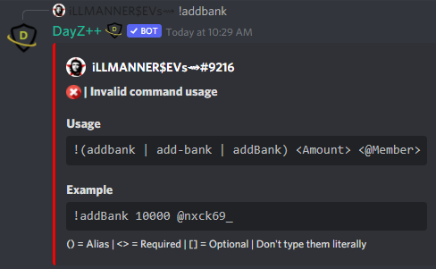

# Add Money to Bank
 This command allows `Killfeed Admin` to easily distribute cash amounts of currency to a member's "bank" account and can be used to either pay individuals directly or to add currency to your own bank account and that of your fellow staff to distribute or utilize accordingly to help stimulate the economy however you decide is best.

> #### Command invoke: ```!addbank```

!!! note
> + The command will not work if executed with an argument to ping a role, only individual members.
> + `Killfeed Admin` always retain ability to perform commands to adjust a member's balance amounts despite being banked or on-hand.
> + For distributing money across multiple members, consider [Issuing Paychecks](../economy/paychecks.md) instead.

!!! usage
```
!addbank <amount> <@Member>
```

!!! example

``` {.sql title="Add Cash Command Examples" linenums="1"}
!addbank 10000 @nxck69_
!add-bank 20000 @nxck69_
!addbank 1500 @nxck69_
```


> 
> 
> 