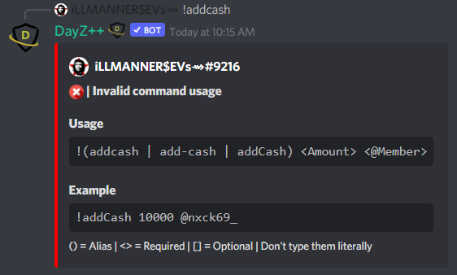

# Add Money to Cash
 This command allows `Killfeed Admin` to easily distribute cash amounts of currency to a member's "on hand" amount and can be used to either pay individuals directly or to add cash to your own account and that of your fellow staff to distribute or utilize accordingly.

> #### Command invoke: ```!addcash```

!!! note
> + The command will not work if executed with an argument to ping a role, only individual members.
> + `Killfeed Admin` always retain ability to perform commands to adjust a member's balance amounts despite being banked or on-hand.
> + For distributing money across multiple members, consider [Issuing Paychecks](../economy/paychecks.md) instead.

!!! usage
```
!addcash <amount> <@Member>
```

!!! example

``` {.sql title="Add Cash Command Examples" linenums="1"}
!addcash 10000 @nxck69_
!add-cash 20000 @nxck69_
!addCash 1500 @nxck69_
```


> 
> 
> 