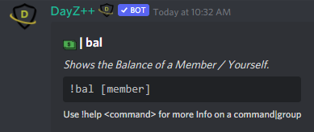
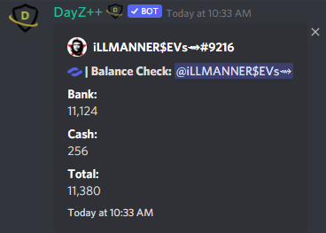

# Check Balance

 This command allows all users to check their balance and the balances of other members.

> #### Command invoke: ```!bal```

!!! note
> + The output will provide balance amounts for both Cash and Bank amounts as well as the combined total.
> + This command __must__ be executed witihin the dedicated channel for **Economy** commands or it will result in an error message; reference [Dashboard](../dashboard/dashboard.md) to configure the module dedicated channels.
> 
> 

!!! usage
```
!bal <@Member>
```

!!! example

``` {.sql title="Balance Command Examples" linenums="1"}
!bal @nxck69_
!balance @nxck69_
```
> 
> 
> 