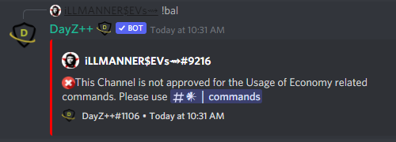

# Deposit Cash

 This command allows all users to deposit any currency gained through gameplay or use of the bot's other economy commands directly into their bank accounts. If executed by itself it will automatically deposit the entire amount of currency a member has in cash-on-hand. It can also be executed alongside of an amount argument, which will deposit only the given amount into the bank account, and retain the remainder as cash-on-hand.

> #### Command invoke: ```!deposit```     | Command  alias: ```!dep```

!!! note
> + The bank account feature allows members to retain their currency safe and secure from being robbed by other members. 
> + `Killfeed Admin` always retain ability to perform commands to adjust a member's balance amounts despite being banked or on-hand.
> + This command __must__ be executed witihin the dedicated channel for **Economy** commands or it will result in an error message; reference [Dashboard](../dashboard/dashboard.md) to configure the module dedicated channels.
> 
> 

!!! usage
```
!dep [amount]
```

!!! example

``` {.sql title="Balance Command Examples" linenums="1"}
!dep
!deposit <amount>
```

> 
