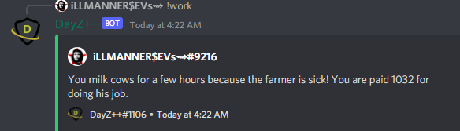

# Work Command
 This command allows members to earn currency through the bot's economy commands by doing an honest day's worth of work.

> #### Command invoke: ```!work```

!!! note
> + Cooldown timers and payout rate percentage, and minimum/maximum amounts can be set by the `Killfeed Admin` from the [Dashboard](https://www.killfeed.xyz) panel under the **__Economy__** section.

!!! usage
```
!work
```

!!! example

``` {.sql title="Work Command Examples" linenums="1"}
!work
```

> 